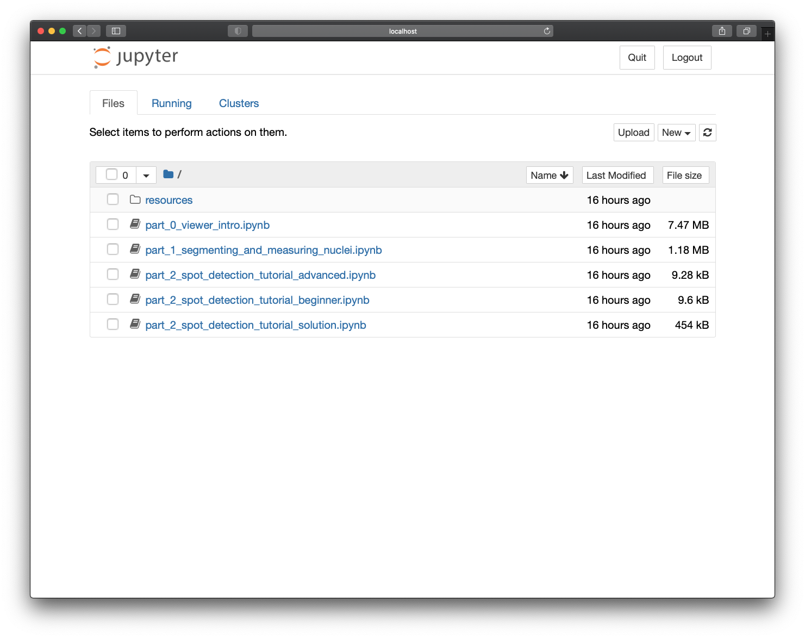

(launch-notebooks)=
# Prep 3: Launching this tutorial's Jupyter notebooks

During this tutorial, we will be working through a set of Jupyter notebooks.
On this page, we will launch the `jupyter notebook` application.

```{tip}
This tutorial uses Markdown files (suffixed with `.md`) to represent jupyter notebooks
managed by [jupytext](https://jupytext.readthedocs.io/en/latest/).
Once you have installed jupytext (as per the previous instructions), the experience
should be the same as using a regular Jupyter notebook: launch `jupyter notebook` or
`jupyter lab`, go to the "notebooks" folder, and click on each notebook as instructed by
the tutors.
```

Open your terminal and navigate to the `notebooks` subdirectory of the
`napari-workshop-template` directory you just downloaded.

```sh
cd <path to tutorial folder with README>/tutorial/notebooks
```

Now activate the `napari-tutorial` conda environment you created in the 
installation step.

```
conda activate image-analysis-23
```

To start the Jupyter Notebook application, enter

```sh
jupyter notebook
```

Jupyter Notebook will open in a browser window and you will see the following
notebooks:

- `part_0_viewer_intro.ipynb`: in this activity, you will gain familiarity with
  loading and viewing images in napari.
- `part_1_segmenting_and_measuring_nuclei.ipynb`: in this notebook, you will use
  cellpose to segment nuclei and scikit-image to measure them.
- `part_2_spot_detection_tutorial_beginner.ipynb`: this is the spot detection
  notebook for people new to image processing with Python
- `part_2_spot_detection_tutorial_advanced.ipynb`: this is the spot detection
  notebook for people with experience performing image processing with Python
- `part_2_spot_detection_tutorial_solution.ipynb`: this is the solution to the
  spot detection activity.

All of the "part 2" notebooks cover the same activities, with different levels
of engagement required to reach the solution. For your convenience, we have
rendered the solutions to these notebooks in the following pages.


