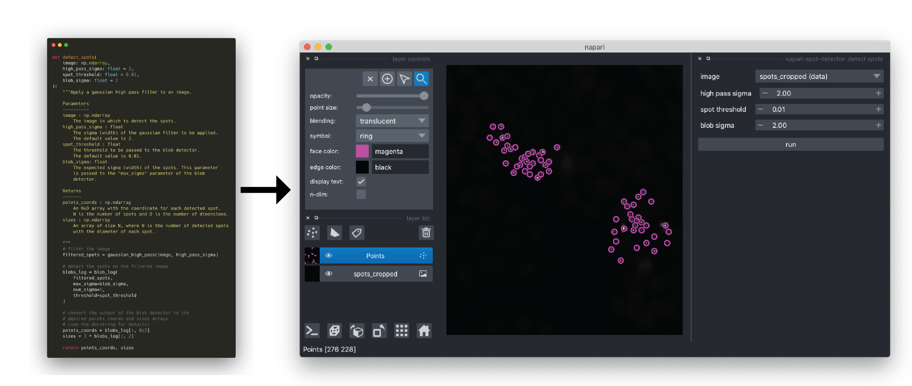

# Creating a napari plugin

## Overview

In addition to being a viewer accessible from Python, napari supports *plugins*
to add functionality to the viewer and to bundle custom functions into a nice
user interface.

In this tutorial, we will make a napari analysis plugin for the watershed
segmentation we implemented in the previous section.

The steps in making a napari plugin are as follows:

1. choose which manifest contribution(s) your plugin requires
2. create a repository using the napari cookiecutter template
3. implement your contributions
4. share your plugin with the community

In the following sections, we will work through steps (1) - (3). For step (4)
you can refer to the [in depth plugin
tutorial](https://www.youtube.com/watch?v=NL-VywidzXE),
or [the instructions on
napari.org](https://napari.org/stable/plugins/test_deploy.html#preparing-for-release).



## Choosing a contribution

A contribution is a list item in `napari.yaml` (the manifest file) that napari
uses for each specific type of plugin. Each contribution conforms to a function
signature, i.e. the function linked to the contribution defines what napari
provides to the plugin (e.g., data and parameters) and what the plugin returns
to napari. napari is then able to use the functions pointed to in `napari.yaml`
to carry out the plugin tasks. The current categories of contributions are
described below. Please see the [contribution
reference](https://napari.org/stable/plugins/contributions.html) and
[contribution guide](https://napari.org/stable/plugins/guides.html) for more
details. Many plugins declare multiple contributions to provide all of the
desired functionality.

- **reader**: allows loading of specified data formats into napari layers
- **writer**: this allows layer data to be written to disk in specified formats
- **sample data**: allows developers to provide users with sample data with their plugin.
- **widget**: allows custom Qt widgets (GUIs) to be added to napari, either from a `magic_factory` widget, a plain function, or a subclass of QWidget
- **theme**: allows customization of the entire napari viewer appearance e.g. light theme or dark theme

In this tutorial, we will create a widget to run the watershed segmentation
from previous part of this workshop.

## Using the cookiecutter template to create your plugin directory

To make creating plugins easier, we provide a template that automatically
builds most of the infrastructure for your plugin, so you can focus on
implementing the details unique to your plugin. The template is provided using
a command line utility called
[`cookiecutter`](https://github.com/cookiecutter/cookiecutter). In the
following steps, you will build your plugin directory using the cookiecutter
template.

In this next step, we will use `cookiecutter` to create a directory for our
plugin from the template. `cookiecutter` will ask a series of questions that
that will customize the directory for your plugin. Once completed, a new
directory will be created in your current directory. It will come
pre-initialised with a git repository.

```bash
cookiecutter https://github.com/napari/cookiecutter-napari-plugin
```

You will be asked for some information to customize the setup of your plugin.
Each prompt gives the default value in square brackets (`[]`). The questions
are explained below. Enter your answer after the prompt and press enter to
continue.

- `full_name [Napari Developer]`: enter your name here. Names entered here will
  be listed as the authors of the plugin in the package metadata.
- `email [yourname@example.com]`: this email will be listed as the contact
  information in the package metadata
- `github_username_or_organization [githubuser]`: if you have a github
  username, you can enter it here. It will be used to generate a GitHub URL for
  you after you enter a plugin name.
- `plugin_name [napari-foobar]`: enter the name you would like your plugin to
  be called. spaces are not allowed and are often replaced with `-` (e.g.,
  `napari-watershed`). This will be your PyPI package name (if you choose
  to deploy your plugin).
- `Select github_repository_url:` this is used for plugin metadata and is not
  required now. If you don't plan to upload it to your github, select 2.
- `module_name [napari_foobar]`: this is the name of the module containing your
  plugin code. Typically, this is the plugin name with the `-` replaced with
  `_` (e.g., `napari_watershed`).
- `display_name [napari FooBar]`: this name will show up in the napari viewer
  and on the napari hub if you release your plugin. You should pick something
  human readable and ideally indicative of what your plugin does. There are no
  restrictions on the symbols in this name.
- `short_description [A simple plugin to use with napari]`: give a one sentence
  description of your plugin. This will go into the readme.
- `include_reader_plugin [y]`: answer `y` (for yes) if you would like a reader
  contribution. We do not need a reader contribution for this tutorial, so
  answer `n` for no.
- `include_writer_plugin [y]`: answer `y` (for yes) if you would like a writer
  contribution. We do not need a writer contribution for this tutorial, so
  answer `n` for no.
- `include_sample_data_plugin [y]`: answer `y` (for yes) if you would like a
  sample data contribution. We do not need a sample data contribution for this
  tutorial, so answer `n` for no.
- `include_dock_widget_plugin [y]`: answer `y` (for yes) if you would like a
  widget contribution. We are implementing a widget contribution for this
  tutorial, **so answer `y` for yes**.
- `use_git_tags_for_versioning [n]`: we will not be covering setting plugin
  versions in this tutorial, so enter `n` for no.
- `install_precommit [n]`: we will not be covering precommit in this tutorial,
  so enter `n` for no.
- `Select license`: select the license you would like to use for your plugin.
  The license sets the rules for how others can build upon and re-use your
  plugin code. For more information on typical open source licenses,
  [choosealicense.com](https://choosealicense.com/) is a good primer. The
  default choice is [BSD-3](https://opensource.org/licenses/BSD-3-Clause),
  which is common in the Scientific Python ecosystem.

After completing all of the questions, a directory will be created containing
your new napari plugin. You will be given instructions on how to upload the
initialized git repository to GitHub. By default, we will not be covering this
aspect in the tutorial, but please feel free to ask the teaching team if you
would like to give it a try. Your new plugin directory (assuming you called the
plugin `napari-watershed` and the module `napari_watershed`) will be
organized as follows (with some irrelevant files/folders omitted)

```
napari-watershed
├── .github
│   └── workflows
│       └── test_and_deploy.yml
├── LICENSE
├── MANIFEST.in
├── .napari
│   └── DESCRIPTION.md
├── pyproject.toml
├── README.md
├── setup.cfg
├── src
│   └── napari_watershed
│       ├── __init__.py
│       ├── napari.yaml
│       ├── _tests
│       │   ├── __init__.py
│       │   └── test_widget.py
│       └── _widget.py
└── tox.ini
```

See below for explanations about some of the most notable files, but do not
hesitate to reach out to the teaching team if you have questions about any of
the other files.

- `.github/workflows/test_and_deploy.yml`: this is a [github
  actions](https://github.com/features/actions) workflow that will
  automatically run the tests and upload your plugin to pypi (thus making it
  available through the built-in napari plugin browser. Please ask the teaching
  team if you would like to learn how to set up your github repository to
  support the workflow.
- `pyproject.toml` and `setup.cfg`: these files allow your plugin to be built
  as a package and installed by pip. the cookiecutter template has set
  everything up in these files, so you are good to go!
- the `src/` folder contains all the python code for your plugin.
- `src/napari_watershed/_widget.py`: This file contains example
  implementations for different widget contributions. This is where you will
  add your `points_watershed()` function.
- the `src/napari_watershed/napari.yaml` file declares commands and
  contributions for each example widget in the `_widget.py` file. Look at these
  carefully and match up which command & contribution belong to what python
  code in the `_widget.py` file.

You have now set up the directory for your new plugin! You can explore the
directory and files with the file browser. In the next step, you will complete
your plugin by adding your `points_watershed()` function to the `_widget.py`
file.

## Implementing a function GUI

In this step, we will implement our `points_watershed()` function as a plugin
contribution. First, we will add our function to the plugin
package. Then, we will add the type annotations to the function to so that
napari can infer the correct GUI elements to add to our plugin.

We want to edit the file `src/<module_name>/_widget.py`. The file contains some
example code for using a `qtpy` widget, a [`magicgui.magic_factory`
widget](https://pyapp-kit.github.io/magicgui/), or even just a plain function
*with type annotations*. We don't need to customize our widget today so we will
use only the plain function and can delete the rest. We can also rename the
function to `points_watershed`.

We also need to edit `napari.yaml` to remove the other widgets and rename our
function. Find the `command` ID that corresponds to the function widget:

```yaml
- command: napari-watershed.make_func_widget
  autogenerate: true
  display_name: Example Function Widget
```

Rename that to whatever you called your function, make sure to leave
`autogenerate: true`, and update the display name. Napari will then take our
function and generate a widget for it automatically!

Now, you need to:

- write a function `points_watershed`, that takes in a NumPy array of
  coordinates, a numpy array containing edge data, and a numpy array containing
  a mask, and produces a segmentation. The annotations should be
  `napari.types.PointsData`, `napari.types.ImageData`, and
  `napari.types.LabelsData`. The output annotation should be
  `napari.types.LayerDataTuple` — see the [documentation for
  this](https://napari.org/plugins/guides.html#the-layerdata-tuple).
  To write this function you can reuse code from the corresponding steps in the
  segmentation chapter.
- make sure that you put in all the required imports at the top of the file.
- install your plugin into your environment, with `python -m pip install -e .`
  at the root of your repository.

## Testing/Installing your plugin

Go back to the previous lesson and, if it's still running, restart the kernel.
Run it until you have your seed points, and then in the napari Viewer, click
the "Plugin" menu — you should see your plugin function appear. Click on it,
select the inputs, and check that the watershed result is produced and added to
the viewer!

Congratulations! You have made your first napari plugin!

## Explore the other files generated by cookiecutter

Cookiecutter does a lot of work for us, but there is no magic — it's good to
understand what it's doing. One important thing is telling napari that it's
made a plugin. It does this through Python [entry
points](https://packaging.python.org/en/latest/specifications/entry-points/),
which are annotated in the `setup.cfg` file as follows:

```
[options.entry_points]
napari.manifest =
    napari-watershed = napari_watershed:napari.yaml
```

## Bonus exercises

If you have time, you can add more functions to your plugin:
- edge filtering of the nuclei image to get the edges image
- finding the centers of the nuclei using `skimage.measure.peak_local_max`
- finding the mask using `skimage.filters.threshold_li` and
  `scipy.ndimage.binary_fill_holes`

You can then run the whole analysis entirely within napari! This can be a good
way to share any scientific Python code with collaborators who may not know how
to use Python.

Some more ideas:

- add sample data to your plugin. To do so, you would need to implement the [sample data contribution](https://napari.org/plugins/guides.html#sample-data)
- add some tests to the `_tests/test_widget.py` file.
- upload your plugin to github
- start your own plugin
- consult with the teaching team about integrating napari into your workflow
